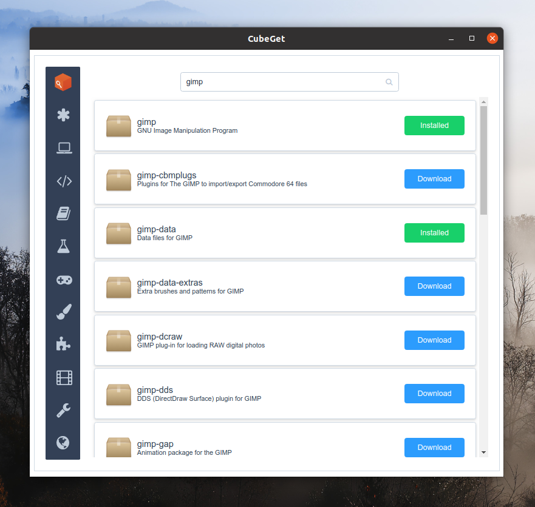

## Camicri Cube
> Portable Package Manager for Linux 

Camicri Cube is a portable package manager aiming to help Linux users without internet access to download applications on another internet connected computer, and install them back to their original computer, offline.

Camicri Cube is a server application built in combination of Vala and Vue.

Written by Jake Capangpangan < camicrisystems@gmail.com >

## Tutorial {docsify-ignore}

Check out this [Guide](/setup-linux) for a step-by-step tutorial on how to setup, download and install packages using Camicri Cube.