# Downloading Packages

A package is a compressed archive containing your application data. An application may have one or more packages. Cube automatically search for all packages needed by the application you want to download.

Before we begin downloading specific packages, let's download first all outdated packages installed in your computer.

# Updating Outdated Packages

Click on `Asterisk -> Upgradable` to list all packages that needs to be updated.

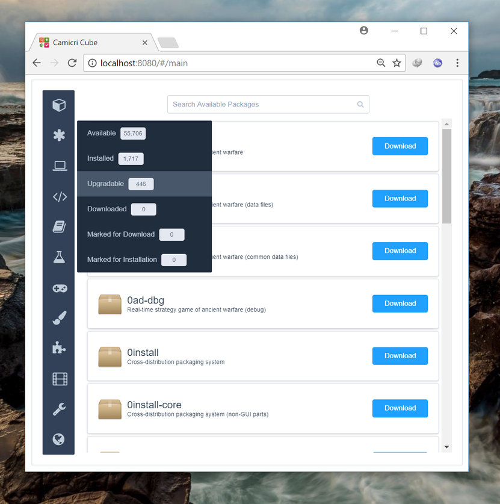

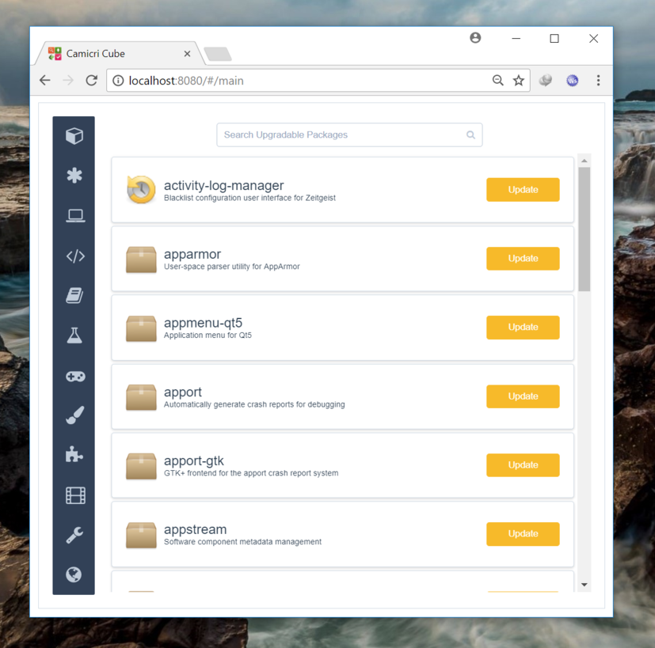

Click on `Cube -> Download -> Mark All Updates for Download`.

Notice that each packages now have a check mark. These packages are now marked for download.

Click on `Cube -> Download -> Download All Marked Packages` to start downloading.

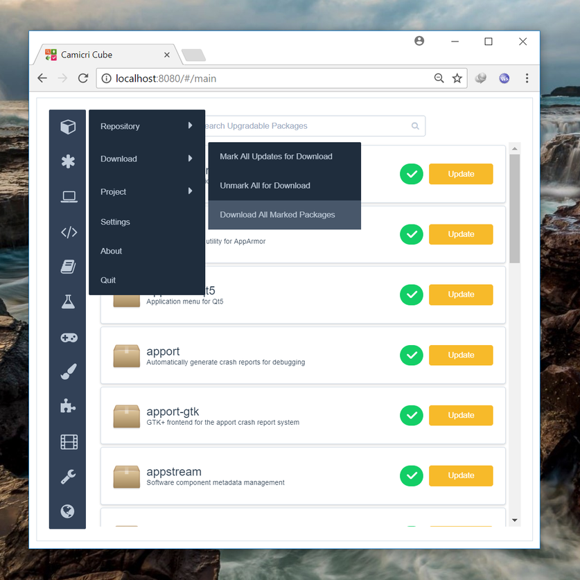

A summary of packages to be downloaded will be shown.

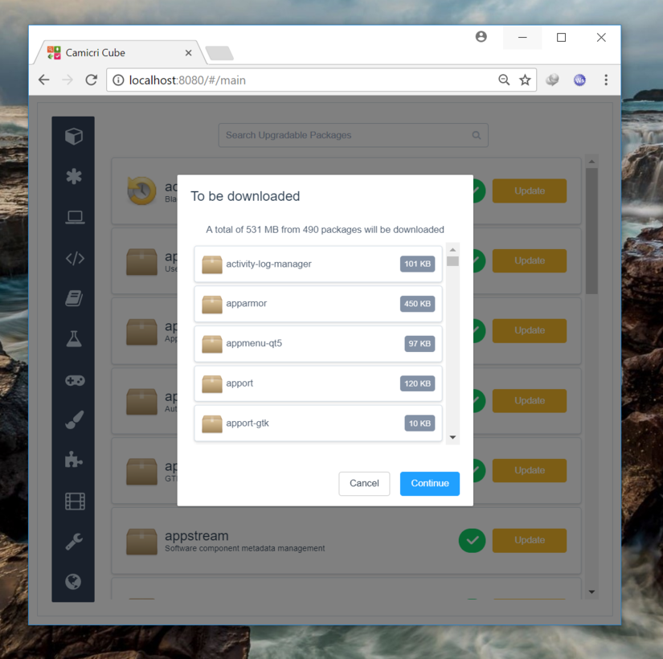

A modal will appear, showing the overall download progress and the current package being downloaded.

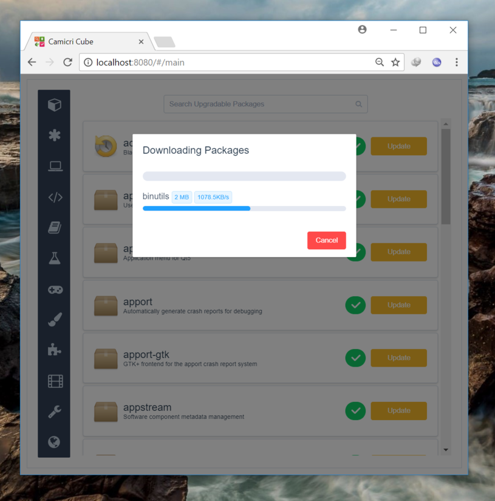

And the packages were now downloaded

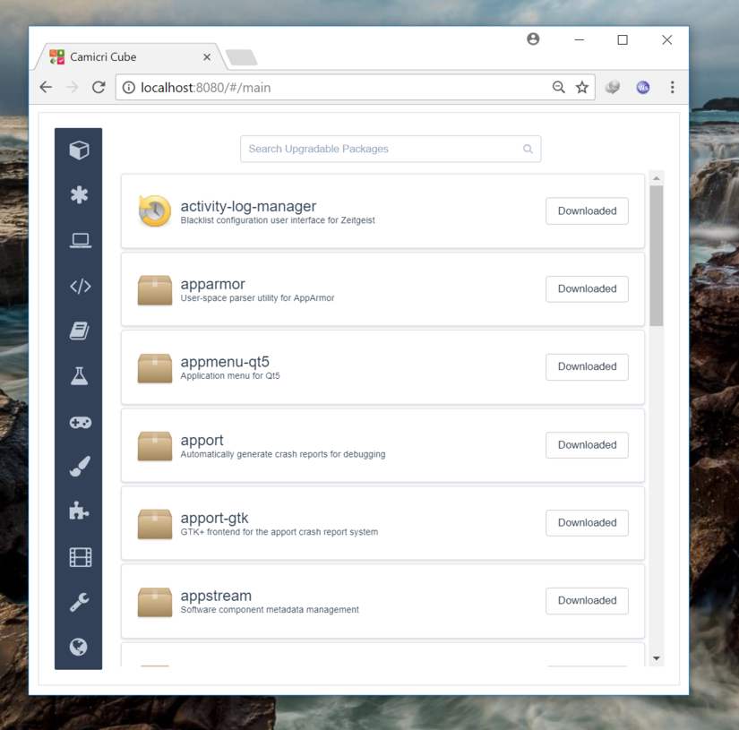

# Searching Packages
Cube provides two ways of searching/listing packages to find them easily.

#### Package Filter {docsify-ignore}
Package lists were provided to filter the packages being shown by Cube. 

`Asterisk` package filter. Showing the primary package filters.

`Games and Amusement`, a category type package filter.

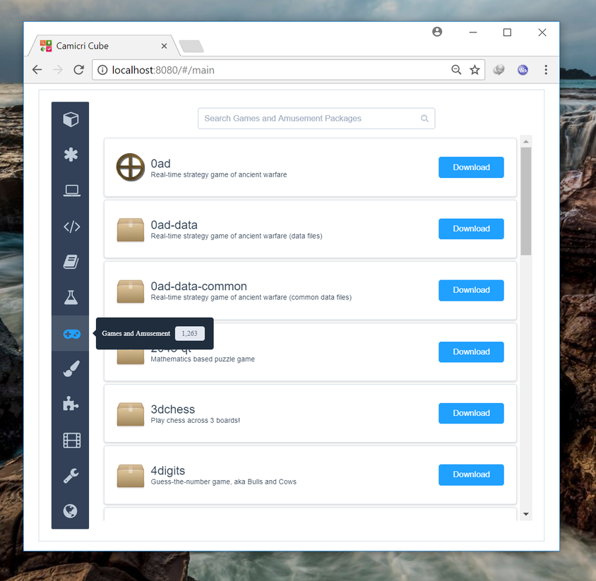

#### Search Bar {docsify-ignore}
The search bar is located at the top of the package list. Cube searches for packages as you type on the search bar.

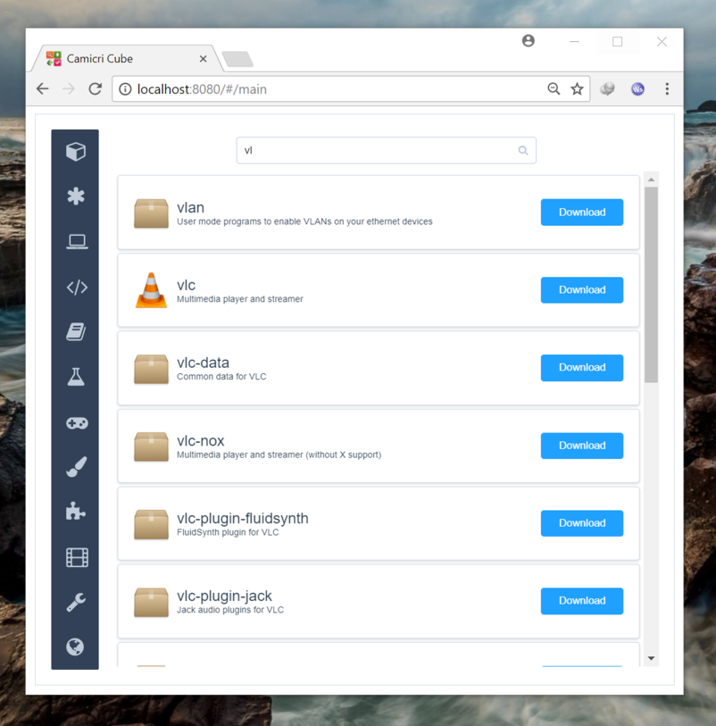

!> The search bar will search packages under the currently selected package filter. To search for all packages, make sure to click `Asterisk => Available` first.

# Downloading Package

Click on the package you want to download in the package lister.

The package viewer will appear, showing the application's desciption, screenshot (if available), and the list of packages needed for that application.

Think of these packages as fragments of your application.

Click the `Download` button to start downloading.

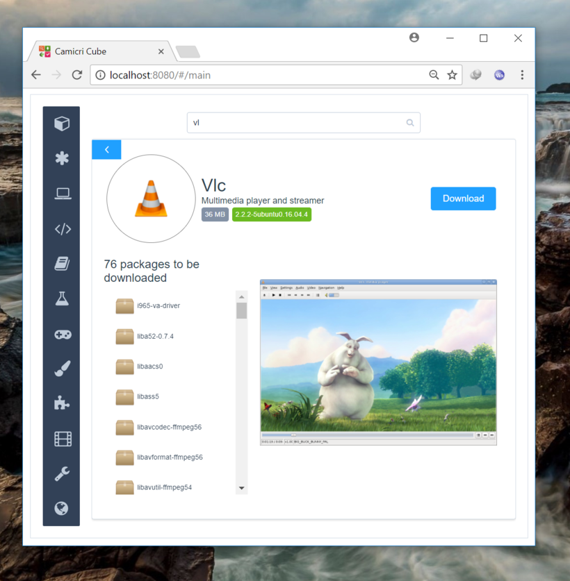

The overall progress including the current package being downloaded will be shown.

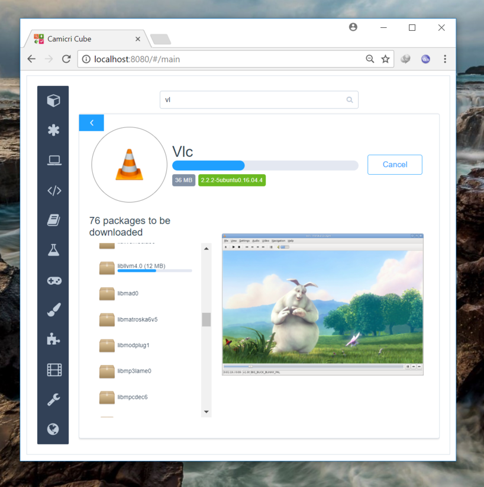

And your application is now downloaded!

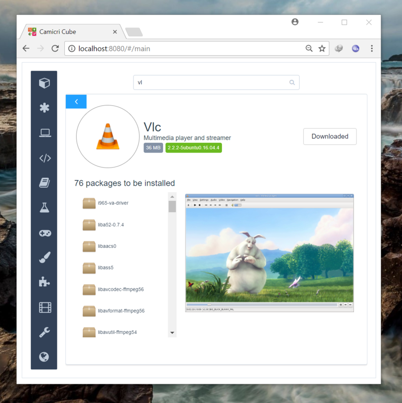

# Transferring Project

After downloading repositories and packages, it is now the time to go back to your Linux computer for installation.

Click `Cube => Quit` to close Cube.

Open `cube\projects` folder. Compress your project and transfer it to any removable devices.

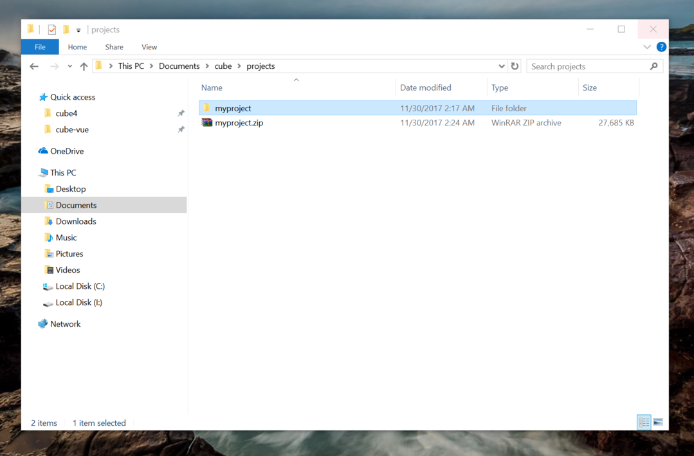