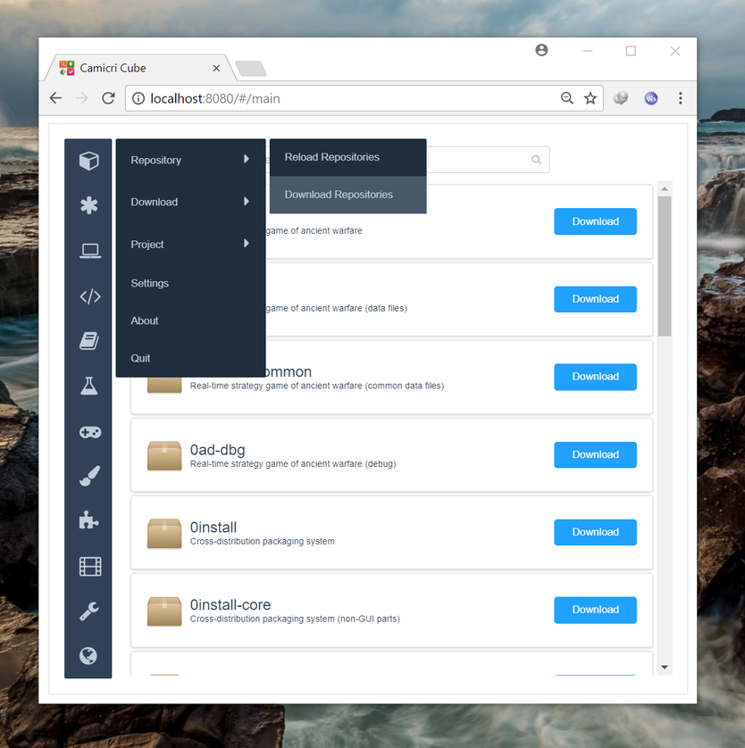
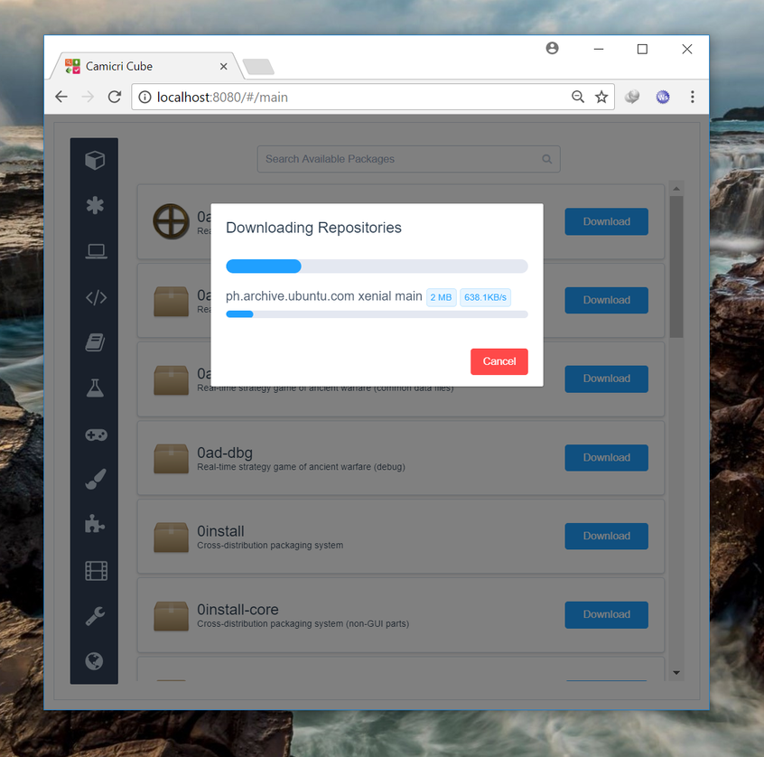
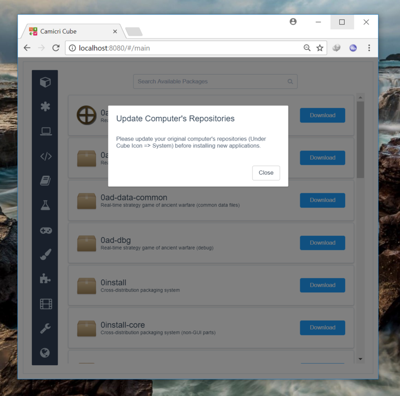

# Downloading Repositories

**Repositories** contain the list of applications you can get for your Linux computer. These repositories should be updated so that you will have new list of available applications, with their latest versions.

Click the `Cube -> Repository -> Download Repositories` to download new repositories. 

A download progress modal will appear, showing the repositories being downloaded and their progress.

After downloading, you will be prompted to update your Linux computer's repositories. This will be done when you transfer your project back to Linux.

This is necessary so that your Linux computer will have updated repository lists before installing packages.

