# Installing Packages

In this guide I'll show you how to transfer back your project, update outdated repositories, and install new packages.

## Transferring Project

On `cube/projects` folder, delete the old project and replace it with the new project.

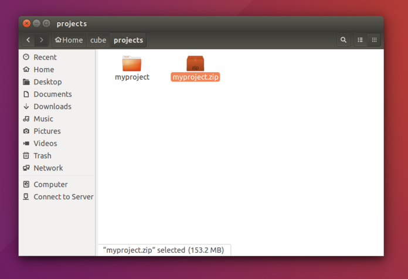

Navigate back to `cube` and double click `cube` to launch.

## Updating Computer's Repository

Since we have downloaded new repositories, we need to update our computer's outdated repositories first before installing new packages.

Click `Cube => System => Update Computer's Repositories`.

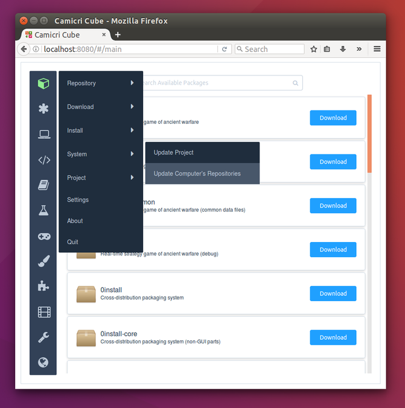

A dialog will appear asking for your credentials. Note that this dialog is from your computer and not from Cube.

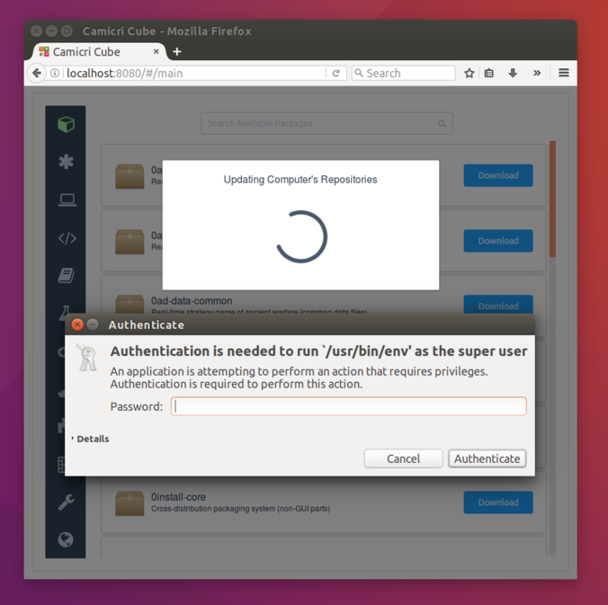

!> Package installation may fail if you don't update your computer's repositories first. This is beacuse your computer's record on the package is outdated and will not match with the new package.

## Installing Package Updates

To install all updates, click `Cube => Install => Mark All Downloaded for Installation` 

And then click `Cube => Install => Install All Marked Packages` to install them.

!> Note that Cube might prevent installation of some apps with packages that needs to be downloaded. To install packages with satisfied downloaded packages, click `Cube => Install => Install All Satisfied Downloaded Packages`

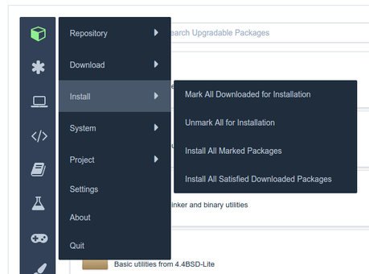

## Installing Package

Search for the package you want to be installed. To display all downloaded packages, click `Asterisk => Downloaded` to change the package filter.

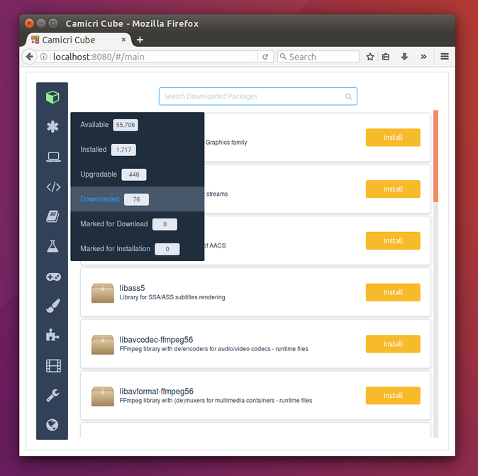

Or search via search bar. Then click `Install`.

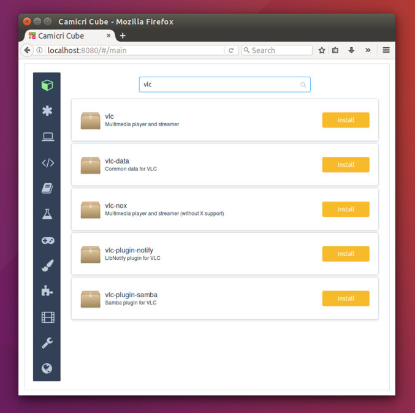

The package viewer will appear, showing the application's description and the list of packages that will be installed.

Click `Install` to begin installation.

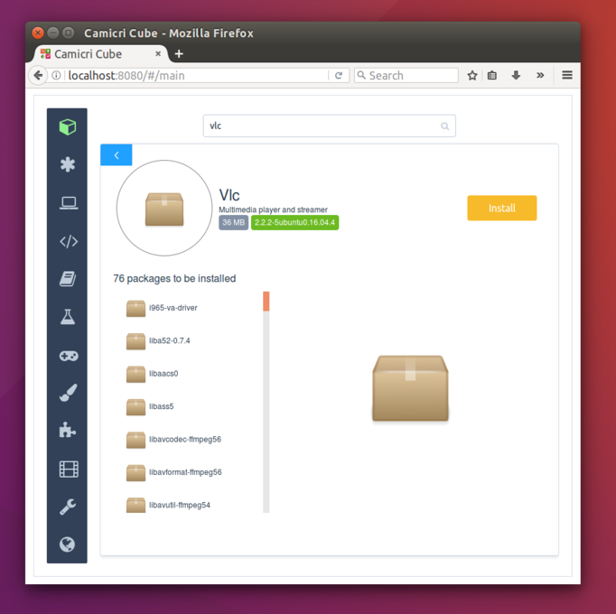

A dialog will appear asking for your credentials.

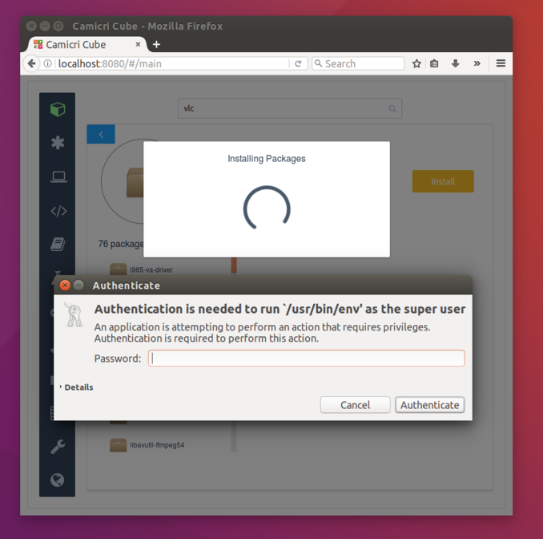

And then a terminal will be launched, showing the current installation progress. This will automatically close when done.

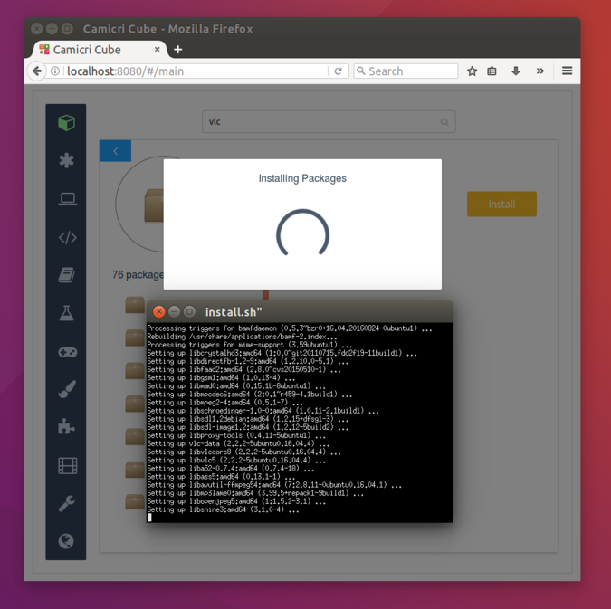

And yey! Your application is now installed!

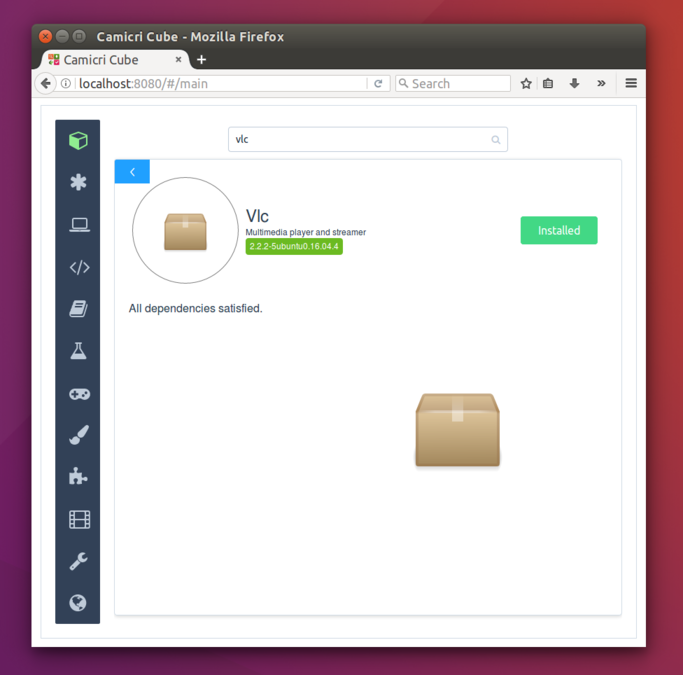

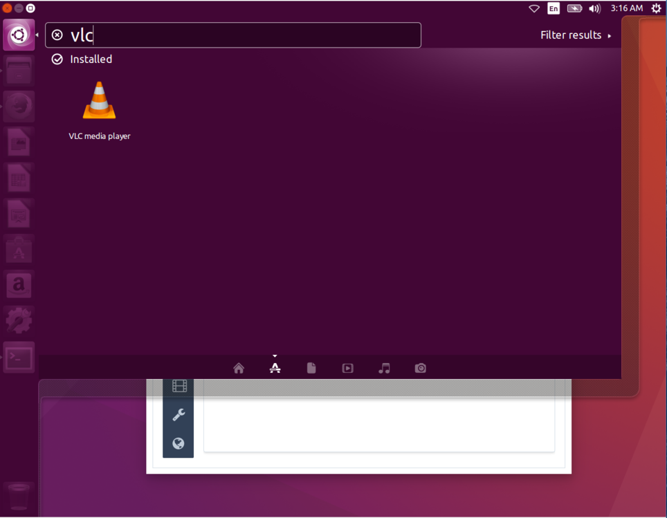

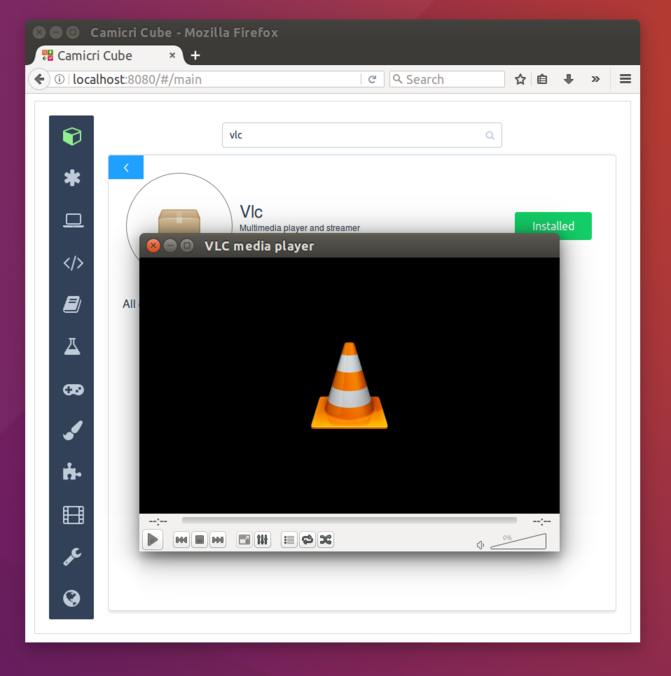

## Cleaning Project

Now that the packages are installed, we can now remove these packages from the project to save space.

Click `Cube => Project => Clean Project`.

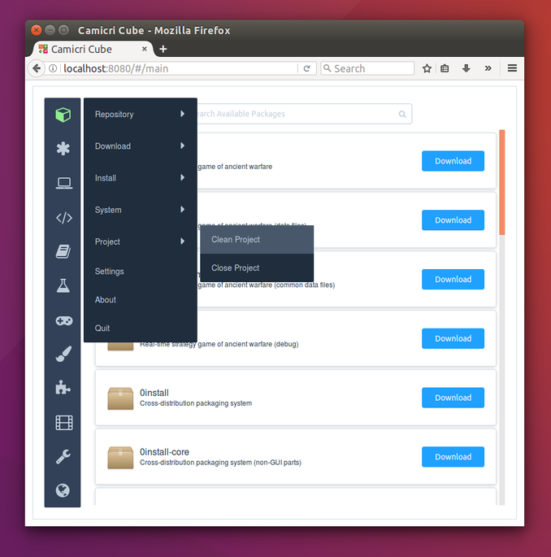

A summary of packages to be removed will be displayed.

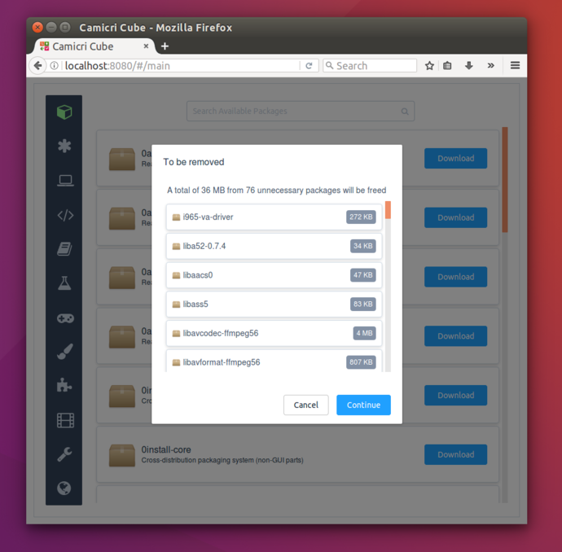

Successfully cleaned!

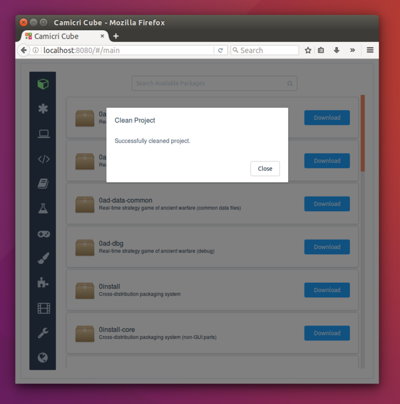

!> Broken packages (Packages which have been partially downloaded will be also removed)