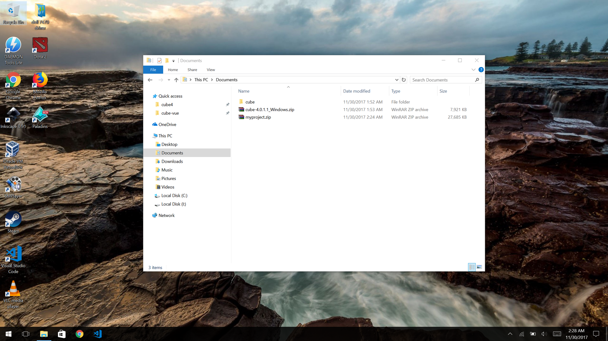
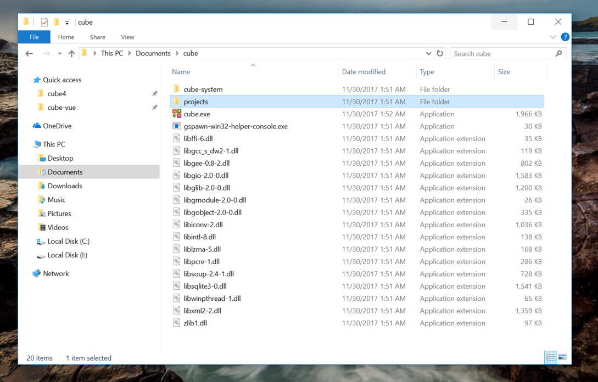
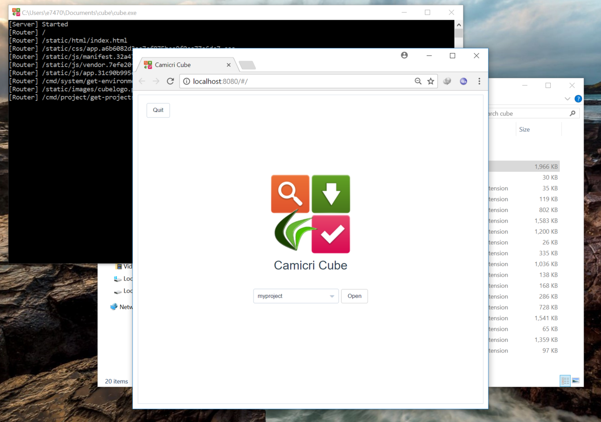

# Setting up on Windows

In this guide I'm going to show you how to setup Cube in Windows computer. I'll be using `Windows 10` as the computer with internet connection.

## Setting up Cube

Copy and extract the `cube` zip on your `Documents` folder.

Open the `cube` folder.

## Transferring Project

Open the `projects` folder and extract our project.

## Launching Cube

Navigate back to the `cube` folder. Double click `cube.exe` to launch Cube.

Notice that our project is now listed on Cube's project list and ready for use.

!> If the project is not listed in the project list, recheck if your project exists in `cube\projects` folder. Reload your browser to refresh project list.

Click `Open` to open the project.